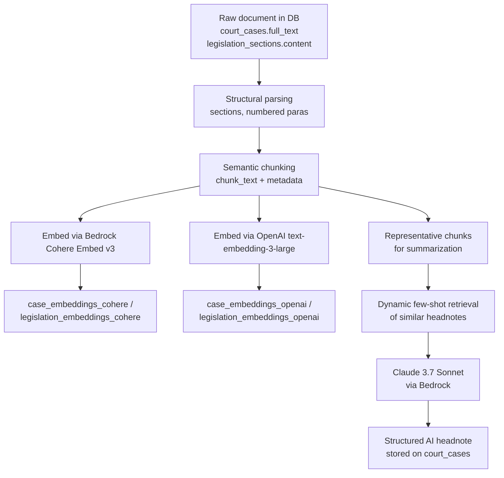
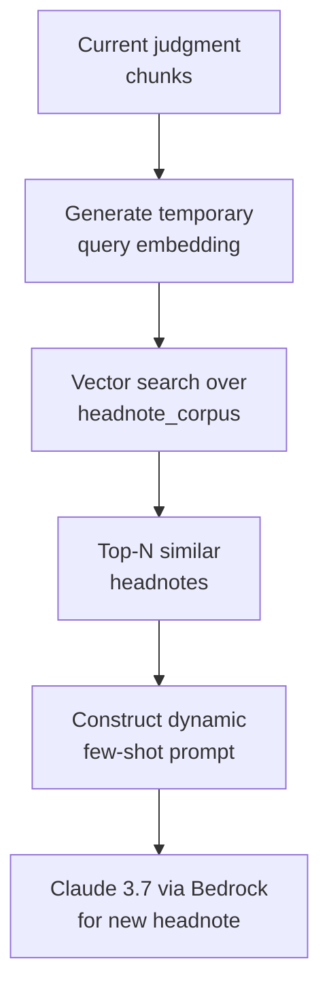

# Bedrock-based Embeddings and Summarization (Embedding Implementation 1)

## 1. Objectives and Scope

This plan describes how to implement a Bedrock-centric embedding and summarization pipeline for Hong Kong legal materials, while also maintaining OpenAI text-embedding-3-large as a parallel backend.

Scope for this iteration:
- Implement semantic chunking for judgments and legislation sections.
- Implement dual embedding backends: Cohere Embed v3 via Amazon Bedrock and OpenAI text-embedding-3-large.
- Design and build an internal corpus of high-quality HK headnotes.
- Implement dynamic few-shot retrieval for headnote generation.
- Implement Bedrock-based headnote generation with Claude 3.7 Sonnet.
- Add batch jobs to populate embeddings and headnotes for existing records.

Out of scope for this iteration:
- API and UI integration of semantic search and headnotes.
- Cross-jurisdiction support beyond Hong Kong.

## 2. Current State Overview

Key existing components:
- Scrapers in `batch/scrapers` that output JSONL files for judiciary and eLegislation.
- Ingestion job `batch/jobs/ingest_jsonl.py` that writes to Supabase/Postgres tables (`court_cases`, `legislation`, `legislation_sections`, `ingestion_jobs`).
- Database schema under `supabase/migrations` includes:
  - `court_cases` with a single `embedding VECTOR(3072)` column.
  - `legislation` and `legislation_sections` with `embedding VECTOR(3072)` columns.
- `docs/specification.md` now specifies:
  - Amazon Titan Text Embeddings V2 and Claude 3.7 Sonnet via Bedrock.
  - Example code for Bedrock-based embeddings and summarization.

There is currently no `batch/pipeline` implementation wired into the live codebase for embeddings or summarization.

## 3. Target Architecture

### 3.1 High-Level Flow



### 3.2 Components

- **Semantic chunker**
  - Parses legal documents into sections and numbered paragraphs.
  - Produces `Chunk` objects with text, `chunk_type`, and structural metadata.
- **Embedding backends**
  - Bedrock-based Cohere Embed v3 backend (primary, 1024 dimensions).
  - Azure OpenAI embedding backend wrapping text-embedding-3-large (secondary, 3072 dimensions), called via Azure OpenAI APIs.
- **Embedding storage**
  - Separate embedding tables per backend and document type.
- **Internal headnote corpus**
  - Curated, anonymised or public HK headnotes.
  - Indexed with embeddings for retrieval.
- **Headnote generator**
  - Claude 3.7 Sonnet via Bedrock.
  - Uses structured legal prompt with dynamic few-shot examples.
- **Batch jobs**
  - Populate embeddings for existing cases and legislation.
  - Generate AI headnotes for cases.

## 4. Semantic Chunking Design

### 4.1 Chunk Data Model

Define a shared data model in a new module, for example `batch/pipeline/chunking.py`.

- `Chunk`
  - `id`: opaque in-memory identifier.
  - `doc_type`: `"case"` or `"legislation"`.
  - `doc_id`: UUID or primary key from `court_cases` / `legislation_sections`.
  - `chunk_index`: integer index within document.
  - `text`: `chunk_text` string.
  - `chunk_type`: e.g. `"facts"`, `"issues"`, `"reasoning"`, `"order"`, `"section_body"`, `"schedule"`.
  - `paragraph_numbers`: list of paragraph numbers covered (for judgments).
  - `section_path`: optional string path for legislation (e.g. `"Part 3 > s.4 > (2)"`).

### 4.2 Chunking Strategy

**Judgments**

- Parse `full_text` into logical units by:
  - Detecting neutral citation and court headings (for metadata only).
  - Splitting on numbered paragraphs where patterns such as `"[1]"`, `"(1)"`, or `"1."` followed by capitalized first words appear.
- Group paragraphs into chunks:
  - Target 800–1500 tokens worth of text per chunk.
  - Never split a paragraph across chunks.
  - Use whole-paragraph overlaps between chunks (e.g. last 1–2 paragraphs of previous chunk).
- Heuristics to assign `chunk_type` for judgments:
  - First paragraphs: likely `"facts"` or `"background"`.
  - Sections starting with terms like `"Issues"`, `"Questions for determination"` → `"issues"`.
  - Long central sections with analysis and citations → `"reasoning"`.
  - Final paragraphs with `"For these reasons"`, `"The appeal is dismissed"` → `"order"`.

**Legislation**

- Work primarily at the section level.
  - Each entry in `legislation_sections` is already a logical unit.
- For very long sections:
  - Further split on subheadings or lettered paragraphs where present.
  - Maintain `section_path` from the legislation structure (e.g. chapter/part/section/subsection labels).

### 4.3 Chunking Pipeline

```mermaid
flowchart LR
  A[Fetch document\nfrom DB] --> B[Parse structure\n(paragraphs / sections)]
  B --> C[Assign labels\nchunk_type, section_path]
  C --> D[Group into\nchunks with overlap]
  D --> E[Yield list of\nChunk objects]
```

Implementation steps:

- Implement a paragraph splitter for judgments (regex-based, with tests).
- Implement a section-based splitter for `legislation_sections`.
- Implement a `chunk_grouper` that takes a list of paragraphs or section segments and outputs `Chunk` objects respecting size and overlap constraints.
- Add unit tests in `batch/tests` for typical HK judgments and legislation HTML converted to text.

## 5. Embedding Backends and Storage

### 5.1 Abstraction Layer

Create `batch/pipeline/embeddings.py` with an abstraction for backends.

- `EmbeddingBackend` (abstract base)
  - properties: `name`, `model_id`, `dimension`, `provider`.
  - `async embed(texts: list[str]) -> list[list[float]]`.

Concrete implementations:

- **`BedrockCohereEmbeddingBackend`**
  - `provider`: `"bedrock-cohere"`.
  - `model_id`: from environment, e.g. `BEDROCK_COHERE_EMBED_MODEL`.
  - `dimension`: 1024.
  - Uses `boto3` `bedrock-runtime` `invoke_model` with the Cohere embed model.
- **`OpenAIEmbeddingBackend`**
  - `provider`: `"azure-openai"`.
  - `model_id`: logical name for the Azure OpenAI embedding deployment (e.g. `AZURE_OPENAI_EMBED_DEPLOYMENT`).
  - `dimension`: 3072.
  - Uses the Azure OpenAI embeddings endpoint, configured via environment (e.g. `AZURE_OPENAI_ENDPOINT`, `AZURE_OPENAI_API_KEY`, `AZURE_OPENAI_EMBED_DEPLOYMENT`), rather than the public OpenAI API.

### 5.2 Database Schema Changes

Define new embedding tables instead of overloading existing 3072-d columns.

**For `court_cases`**

- `case_embeddings_cohere`
  - `id` UUID PK.
  - `case_id` UUID FK → `court_cases(id)`.
  - `chunk_index` INT.
  - `chunk_type` TEXT.
  - `chunk_text` TEXT.
  - `embedding` VECTOR(1024).
  - `created_at` TIMESTAMPTZ.
  - `UNIQUE(case_id, chunk_index)`.

- `case_embeddings_openai`
  - Same structure but `embedding VECTOR(3072)`.

**For `legislation_sections`**

- `legislation_embeddings_cohere`
  - `section_id` UUID FK → `legislation_sections(id)`.
  - analogous columns, `VECTOR(1024)`.

- `legislation_embeddings_openai`
  - analogous, `VECTOR(3072)`.

Add a new migration under `supabase/migrations` to create these tables and indexes (`ivfflat` on `embedding` with `vector_cosine_ops`).

### 5.3 Embedding Generation Flow

```mermaid
flowchart TD
  A[Chunks for document] --> B[Backend: bedrock-cohere]
  A --> C[Backend: openai]

  B --> D[Vectors (1024-d)]
  C --> E[Vectors (3072-d)]

  D --> F[Insert into\ncase_embeddings_cohere /\nlegislation_embeddings_cohere]
  E --> G[Insert into\ncase_embeddings_openai /\nlegislation_embeddings_openai]
```

Implementation steps:

- Implement `generate_embeddings_for_chunks(chunks, backend)` that:
  - Batches API calls (e.g. 32–64 texts per request) to respect rate limits.
  - Returns a list of `EmbeddingRecord` objects with `chunk_index`, `chunk_text`, `embedding`, and metadata.
- Implement persistence helpers in `batch/pipeline/db_writer.py`:
  - `upsert_case_embeddings(case_id, backend_name, records)`.
  - `upsert_legislation_embeddings(section_id, backend_name, records)`.

### 5.4 Retrieval Strategy (Later)

In future API work, support:

- Configurable backend at query time: `primary_cohere` or `primary_openai`.
- Optional hybrid:
  - Query both embeddings tables.
  - Take top `k1 + k2` chunks and rerank with Cohere rerank model via Bedrock.

For this plan, focus on building embeddings and their storage; retrieval logic can be added in a later phase.

## 6. Internal Headnote Corpus and Dynamic Few-Shot Retrieval

### 6.1 Corpus Construction

Goal: small, high-quality internal corpus of HK headnotes (or headnote-style summaries) to use as dynamic few-shot examples.

Sources:

- Publicly available HK headnotes where licensing permits.
- Synthetic headnotes manually reviewed and curated for quality.

Data model (e.g. table `headnote_corpus`):

- `id` UUID PK.
- `neutral_citation` TEXT.
- `court_code` TEXT.
- `subject_tags` TEXT[] (e.g. `["criminal", "joint enterprise"]`, `["public law", "judicial review"]`).
- `headnote_text` TEXT (structured as in the target output format).
- `source` TEXT (e.g. `"official"`, `"synthetic"`).
- `embedding_cohere` VECTOR(1024) (optional but recommended).
- `embedding_openai` VECTOR(3072) (optional but recommended).

### 6.2 Indexing the Corpus

```mermaid
flowchart TD
  A[Curated headnote corpus\n(headnote_corpus)] --> B[Embed text\nvia bedrock-cohere]
  A --> C[Embed text\nvia openai]

  B --> D[Store embedding_cohere\non headnote_corpus]
  C --> E[Store embedding_openai\non headnote_corpus]
```

Implementation steps:

- Create `headnote_corpus` table via migration.
- Provide a small seeding script in `batch/scripts/seed_headnote_corpus.py` that inserts initial examples.
- Reuse the embedding backend abstraction to generate and store corpus embeddings.

### 6.3 Runtime Few-Shot Selection

At headnote generation time for a given judgment:

- Compute an embedding for a short representation of the judgment (e.g. first few paragraphs or a combined summary of top reasoning chunks) using the same embedding backend as the corpus index (e.g. Cohere via Bedrock).
- Perform vector search over `headnote_corpus.embedding_cohere` to retrieve the top N similar headnotes (e.g. N = 2 or 3).
- Extract their structured text and embed them into the prompt as dynamic few-shot examples.



This approach adapts few-shots to the subject matter (criminal, public law, land, etc.) and should improve summarization quality and consistency.

## 7. Headnote Generation Pipeline

### 7.1 Prompt Design

Use a structured legal prompt with explicit sections:

- Citation.
- Court.
- Procedural posture.
- Issues.
- Holdings.
- Legal principles.
- Disposition.
- Key citations.

Combine:

- System role: explain expectations (formal, neutral, HK-specific).
- Dynamic few-shots: examples from `headnote_corpus`.
- Judgment text: preferably selecting the most relevant reasoning chunks based on embeddings instead of the entire document.

### 7.2 Implementation Steps

1. Create `batch/pipeline/summarizer.py` with:
   - `build_headnote_prompt(judgment_text, dynamic_examples) -> str`.
   - `generate_headnote_bedrock(judgment_id) -> str`.

2. For each judgment:

   - Fetch `full_text` and metadata (`neutral_citation`, `court_code`, `decision_date`).
   - Run semantic chunking and (optionally) select top K reasoning chunks via embeddings to limit token usage.
   - Build an intermediate summary/representation for similarity search against `headnote_corpus`.
   - Retrieve dynamic few-shot examples.
   - Call Claude 3.7 Sonnet via Bedrock with the constructed prompt.
   - Store the resulting headnote into `court_cases.headnote` (or into a separate `ai_headnote` column if you prefer preserving any existing headnote data).

3. Add logging and simple quality counters:

   - Number of headnotes generated.
   - Average token usage per headnote.
   - Error counts.

## 8. Batch Jobs, Orchestration, and Infrastructure

### 8.1 Embedding Population Jobs

Add new job modules under `batch/jobs`:

- `jobs/generate_embeddings_cases.py`
- `jobs/generate_embeddings_legislation.py`

Responsibilities:

- Query DB for items without embeddings in the target tables (e.g. cases where no rows exist in `case_embeddings_cohere`).
- Process in batches (e.g. 50–100 documents per batch):
  - Semantic chunking.
  - Embedding generation for both backends.
  - Persist to respective embedding tables.
- Support resume capability via `ingestion_jobs` or a new tracking table (e.g. `embedding_jobs`).

### 8.2 Headnote Generation Job

Add `jobs/generate_headnotes.py`:

- Fetch `court_cases` without a generated AI headnote.
- For each case:
  - Ensure chunks and embeddings exist (optionally recompute if missing).
  - Retrieve dynamic examples from `headnote_corpus`.
  - Call Bedrock summarizer and store headnote.
- Support flags:
  - `--limit` (number of cases to process).
  - `--court-codes` (filter by court).
  - `--dry-run` (log but do not write to DB).

### 8.3 Operational Considerations

- **Rate limiting**:
  - Per-backend concurrency settings to avoid overrunning Bedrock or Azure OpenAI quotas.
- **Error handling**:
  - Retry with exponential backoff on transient errors.
  - Flag failed documents in a separate table or in `ingestion_jobs.error_message` for later review.
- **Cost control**:
  - Optional `max_documents_per_run` to cap spend.

### 8.4 Infrastructure as Code

- All cloud infrastructure required for this pipeline (AWS resources for Bedrock access, Azure resources for Azure OpenAI, and any future GCP components) will be provisioned and managed using Pulumi TypeScript stacks.
- Examples include:
  - AWS IAM roles/policies and networking needed to call Bedrock safely from batch jobs.
  - Azure OpenAI resource, deployments for the embedding model, and associated networking.
- No manual console configuration should be relied upon; Pulumi projects should be the single source of truth for cloud configuration.

## 9. Phased Implementation Plan

### Phase 1: Foundations and Schema

- Implement semantic chunker for judgments and legislation.
- Add new migration:
  - `case_embeddings_cohere`, `case_embeddings_openai`.
  - `legislation_embeddings_cohere`, `legislation_embeddings_openai`.
  - `headnote_corpus` table.
- Implement `EmbeddingBackend` abstraction and `BedrockCohereEmbeddingBackend` / `OpenAIEmbeddingBackend`.

### Phase 2: Embedding Pipelines

- Implement embedding generation module that:
  - Runs semantic chunking.
  - Calls both backends.
  - Writes to embedding tables.
- Add `jobs/generate_embeddings_cases.py` and `jobs/generate_embeddings_legislation.py`.
- Seed `headnote_corpus` with a small set of curated examples and generate corpus embeddings.

### Phase 3: Dynamic Few-Shot Headnotes

- Implement summarizer module with dynamic few-shot retrieval from `headnote_corpus`.
- Add `jobs/generate_headnotes.py` for bulk headnote generation.
- Configure and test Bedrock Claude 3.7 Sonnet integration.

### Phase 4: Evaluation and Tuning

- Evaluate retrieval quality using Cohere vs OpenAI embeddings on a small query set.
- Manually review a sample of AI headnotes against official headnotes where available.
- Tune:
  - Chunk sizes.
  - Few-shot retrieval parameters (N examples, similarity thresholds).
  - Prompt wording and structure.

### Phase 5: Prepare for API Integration

- Expose reusable functions for semantic search and headnote retrieval for future Edge Function APIs.
- Document configuration options and operational runbooks for long-running embedding/headnote jobs.
