# How Legal-AI Uses Semantic Chunking, Embeddings, and Headnotes

This document explains, in plain language, how the system:

- Breaks long judgments and legislation into **semantic chunks**
- Turns each chunk into a **numerical fingerprint of its meaning** (embeddings)
- Uses those fingerprints to support **semantic search**
- Generates **AI headnotes/summaries** for quick understanding
- Wires all of this into a **search API flow** that a frontend can call

The goal is to explain how it works end‑to‑end when a user searches for relevant cases to cite.

---

## 1. Big Picture

Traditional legal search mostly does:

- Keyword matching on full text
- Some filters (court, year, citation)

This project adds an AI layer that lets people search by **meaning** instead of just exact words.

High‑level idea:

1. **Chunking** – Split long judgments/sections into sensible pieces ("chunks").
2. **Embedding** – Turn each chunk into a vector (a list of numbers) that captures its meaning.
3. **Semantic search** – Turn the users query into a vector and find the most similar chunks.
4. **Headnotes & summaries** – Use a strong language model to produce structured headnotes so lawyers can quickly see what a case is about.

### 1.1 Flow Diagram (High Level)

```mermaid
flowchart TD
  U[User query] --> QV[Query embedding]
  QV --> VS[Vector search over chunk embeddings]
  VS --> RC[Relevant chunks per case]
  RC --> AGG[Aggregate by case]
  AGG --> HN[Headnotes & metadata]
  HN --> RES[Search results to UI]

  subgraph Offline Pipelines
    D[Judgments & legislation in DB]
    D --> CH[Semantic chunking]
    CH --> CE[Chunk embeddings]
    CE --> IDX[Embedding tables in Postgres]
    CH --> HS[Headnote corpus & summarization]
    HS --> HNDB[AI headnotes stored in DB]
  end

  IDX --> VS
  HNDB --> HN
```



---

## 2. Semantic Chunking

**Problem:** A judgment can be dozens of pages long. If you treat it as one big block of text, you can only say This whole case might be relevant. Thats not very precise.

**Solution:** Break each document into **chunks** that are big enough to have context, but small enough to be specific (e.g. a few paragraphs of reasoning).

### 2.1 Chunk Data Model

In `batch/pipeline/chunking.py`, a `Chunk` represents one semantically coherent piece of text. Each chunk keeps:

- `doc_type`: `"case"` or `"legislation"`
- `doc_id`: which case or section it came from
- `chunk_index`: position in the document (0, 1, 2, ...)
- `text`: the actual text of the chunk
- `chunk_type`: rough label like `"facts"`, `"reasoning"`, `"order"`, or `"section_body"`
- Optional metadata like paragraph numbers or a structural path for legislation

### 2.2 How Judgments Are Chunked

For court cases (`chunk_case_text`):

1. **Split into paragraphs**
   - Detects blank lines and paragraph markers like `[1]`, `(1)`, `1.` at the start of lines.
   - Each marker usually corresponds to a new paragraph in Hong Kong judgments.

2. **Group paragraphs into chunks**
   - Groups paragraphs until a **max character limit** (e.g. 6,000 chars) is reached.
   - Never splits a paragraph across chunks.
   - Adds a bit of **overlap** between chunks (e.g. last 1–2 paragraphs of the previous chunk appear at the start of the next one) so context isnt lost at boundaries.

3. **Assign rough chunk types**
   - First chunk → `"facts"` (background / introduction)
   - Last chunk → `"order"` (outcome / disposal)
   - Everything in between → `"reasoning"`

This is heuristic (and can be improved), but it already gives the system useful structure.

### 2.3 How Legislation Is Chunked

For legislation (`chunk_legislation_section`):

- Each row in `legislation_sections` is already a logical unit (a section or subsection).
- If the section is short → one chunk with `chunk_type="section_body"`.
- If its very long → it is split on blank lines and then grouped into chunks similarly to judgments.
- A `section_path` (like `"Part 3 - s.4 - (2)"`) can be stored for precise references.

### 2.4 Why Chunking Matters

- **Precision** – Search results can point to *specific passages* (e.g. paras [50]–[70]) rather than just this whole 80-page case.
- **Model performance** – Embedding and summarization models work best on medium-sized chunks, not entire books.
- **Better downstream tasks** – You can:
  - Rank chunks by relevance instead of whole documents.
  - Feed just the most relevant chunks into summarization models.
  - Refer back to paragraph numbers and section paths when citing.

---

## 3. Embeddings (Semantic Fingerprints)

Once you have chunks, the next step is to turn each chunk into a **vector**, i.e. a long list of numbers that capture its **meaning**.

**Intuition:**

- Texts with similar meaning end up with **similar vectors**.
- For example, a chunk discussing joint enterprise liability and another discussing parties to a common purpose in a robbery may share few exact words but have **similar embeddings**.

This is handled in `batch/pipeline/embeddings.py`.

### 3.1 Embedding Backends

The code defines an abstract `EmbeddingBackend` and concrete backends such as:

- **BedrockCohereBackend** (backed by Amazon Titan Text Embeddings V2)
  - Uses Amazon Bedrock (`bedrock-runtime`) to call an embedding model.
  - Returns 1,024‑dimensional vectors.
- **AzureOpenAIEmbeddingBackend**
  - Uses Azure OpenAI embeddings (e.g. text-embedding-3-large style deployment).
  - Returns higher-dimensional vectors (e.g. 1,536 dimensions in the current implementation).

This abstraction lets you swap or compare providers while keeping the rest of the pipeline the same.

### 3.2 Generating Embeddings for a Case

For a given case (`generate_case_embeddings`):

1. **Chunk the case**
   - Calls `chunk_case_text(case_id, full_text)` to get a list of `Chunk` objects.

2. **Prepare texts to embed**
   - `texts = [chunk.text for chunk in chunks]`.

3. **Call embedding backends**
   - Send `texts` to Bedrock (and optionally Azure OpenAI).
   - Get back a list of vectors, one per chunk.

4. **Build embedding records**
   - Wrap each result into an `EmbeddingResult` with:
     - `doc_type`, `doc_id`, `chunk_index`, `chunk_type`, `text`, `embedding`.

5. **Persist to Postgres**
   - Insert or upsert into tables such as:
     - `case_embeddings_cohere` (Bedrock-backed embeddings).
     - `case_embeddings_openai` (Azure OpenAI embeddings).
   - Similar flow for `generate_legislation_embeddings` into `legislation_embeddings_*` tables.

After this, the database doesnt just store raw text. It also stores **semantic fingerprints** of each chunk, ready for vector search.

---

## 4. Headnotes and Summarization

Embeddings give you a way to **find relevant passages**. Headnotes give you a way to **quickly understand a case**.

The headnote generator lives in `batch/pipeline/summarizer.py`.

### 4.1 What Is a Headnote Here?

A headnote is a short, structured summary of a case, similar to what you see in official law reports. The template used here forces the model to produce:

- Citation
- Court
- Procedural posture
- Issues (bullet points)
- Holdings
- Legal principles
- Disposition
- Key citations

This makes it easier for lawyers to scan and compare cases.

### 4.2 How a Headnote Is Generated

The main function is `generate_headnote(case_id)`:

1. **Fetch the case**
   - Loads from the `court_cases` table: `id`, `neutral_citation`, `case_name`, `full_text`, `court_code`, etc.

2. **Fetch example headnotes (few-shot examples)**
   - `_fetch_dynamic_few_shots` pulls a small set of example headnotes from a `headnote_corpus` table.
   - These are high-quality, structured headnotes used as examples of the desired style.

3. **Build a prompt**
   - `_build_prompt` injects:
     - The few-shot example headnotes.
     - The text of the judgment (possibly truncated to a safe character limit).
   - Uses `HEADNOTE_TEMPLATE` to instruct the model to follow a strict format.

4. **Call Claude 3.7 Sonnet via Bedrock**
   - A Bedrock client is created for `bedrock-runtime`.
   - The prompt is sent to the Claude model (`headnote_model` from settings).
   - The response is parsed to extract the generated text.

5. **Return the headnote**
   - The caller (typically a batch job) can then store this text on the `court_cases` row (e.g. `ai_headnote`), so it can be shown during search.

### 4.3 Future Enhancement: Embedding-Aware Few-Shot Selection

The design docs describe a more advanced approach where, when generating a headnote for a new judgment, the system will:

1. Create an embedding summarizing the case.
2. Run vector search over `headnote_corpus` embeddings.
3. Select the **most similar existing headnotes** as examples.
4. Insert those into the prompt as few-shot examples.

This makes examples more topical (criminal vs public law vs land, etc.), which should improve headnote quality.

---

## 5. Search API Endpoint: End-to-End Flow

This section sketches what a semantic search API might look like, wiring together query embeddings, vector search, and headnotes.

### 5.1 Example Endpoint Shape

Assume an HTTP API exposed to the frontend. One possible design:

- **Method:** `POST /api/search/cases`
- **Request body:**
  - `query` (string): the users search in natural language.
  - Optional filters, e.g. `courts`, `year_from`, `year_to`, `limit`.
- **Response body:**
  - `results`: list of objects, each containing:
    - `case_id`
    - `neutral_citation`
    - `case_name`
    - `court_code`
    - `decision_date`
    - `score` (similarity score)
    - `headnote` (AI headnote or existing one if present)
    - `highlights`: a few chunks (with paragraph numbers) that matched the query.

### 5.2 Logical Steps Inside the Endpoint

Conceptually, the endpoint does something like this:

1. **Parse input**
   - Read `query` and optional filters (court, date range, etc.).

2. **Embed the query**
   - Use the same embedding backend as was used for the stored embeddings (e.g. Bedrock Titan via `BedrockCohereBackend`).
   - `query_vec = embed_backend.embed([query])[0]`.

3. **Vector search over chunk embeddings**
   - Run a similarity search on the embeddings table, e.g. `case_embeddings_cohere`:
     - Select top `k` chunks whose `embedding` is closest to `query_vec` by cosine distance.
     - Optionally apply filters:
       - Join back to `court_cases` to filter by court or date.

4. **Group and score by case**
   - Group the top chunks by `case_id`.
   - For each case:
     - Compute an overall relevance score (e.g. best chunk score or an aggregate).
     - Keep the best few chunks as `highlights`.

5. **Fetch case metadata & headnotes**
   - For the selected `case_id`s, load:
     - `neutral_citation`, `case_name`, `court_code`, `decision_date`.
     - `ai_headnote` (or another headnote column) if available.

6. **Sort and return results**
   - Sort cases by relevance score (and possibly tie-breaker by date).
   - Return in a JSON structure consumable by the frontend.

### 5.3 Pseudocode Outline

Below is pseudo-Python to illustrate the control flow (details like SQL syntax and frameworks omitted for clarity):

```python
async def search_cases(query: str, *, courts: list[str] | None = None,
                       year_from: int | None = None,
                       year_to: int | None = None,
                       limit: int = 20) -> list[dict]:
    # 1. Embed the query
    query_vec = (await embed_backend.embed([query]))[0]

    # 2. Vector search over chunk embeddings
    chunk_rows = await db.search_case_embeddings(
        query_vector=query_vec,
        courts=courts,
        year_from=year_from,
        year_to=year_to,
        top_k=200,  # more chunks than final cases, for grouping
    )

    # 3. Group by case_id
    cases: dict[str, dict] = {}
    for row in chunk_rows:
        cid = row["case_id"]
        if cid not in cases:
            cases[cid] = {
                "case_id": cid,
                "chunks": [],
                "best_score": row["score"],
            }
        cases[cid]["chunks"].append(row)
        cases[cid]["best_score"] = max(cases[cid]["best_score"], row["score"])

    # 4. Keep top-N cases by best_score
    top_case_ids = [cid for cid, _ in sorted(
        ((cid, data["best_score"]) for cid, data in cases.items()),
        key=lambda x: x[1],
        reverse=True,
    )[:limit]]

    # 5. Fetch metadata and headnotes
    meta = await db.fetch_cases_with_headnotes(top_case_ids)

    # 6. Build response
    results = []
    for cid in top_case_ids:
        data = cases[cid]
        case_meta = meta[cid]
        highlights = sorted(
            data["chunks"], key=lambda r: r["score"], reverse=True
        )[:3]
        results.append({
            "case_id": cid,
            "neutral_citation": case_meta["neutral_citation"],
            "case_name": case_meta["case_name"],
            "court_code": case_meta["court_code"],
            "decision_date": case_meta["decision_date"],
            "score": data["best_score"],
            "headnote": case_meta.get("ai_headnote"),
            "highlights": [
                {
                    "chunk_text": h["chunk_text"],
                    "chunk_type": h["chunk_type"],
                    "paragraph_numbers": h.get("paragraph_numbers"),
                    "score": h["score"],
                }
                for h in highlights
            ],
        })

    return results
```

This is not production-ready code, but it shows how the pieces connect.

---

## 6. Concrete End-to-End Example

This example walks through what happens when a user searches for a practical legal question.

### 6.1 User Query

> "Recent Court of Final Appeal cases on joint enterprise criminal liability, especially where the defendant pleaded guilty and argued mitigation."

### 6.2 System Steps

1. **User calls API**

   Frontend sends:

   ```json
   {
     "query": "Recent Court of Final Appeal cases on joint enterprise criminal liability, especially where the defendant pleaded guilty and argued mitigation.",
     "courts": ["CFA"],
     "year_from": 2018,
     "limit": 10
   }
   ```

2. **API embeds the query**

   - The backend passes the query text to the embedding model (e.g. Titan via Bedrock).
   - Gets back a single vector representing the meaning of the whole question.

3. **Vector search over chunk embeddings**

   - The backend performs a similarity search over `case_embeddings_cohere` restricted to:
     - Cases from the Court of Final Appeal.
     - Decision dates from 2018 onwards.
   - It returns the top ~200 chunks whose embeddings are closest to the query vector.
   - Many of these chunks will be from sections labelled as `"reasoning"` or `"order"` where the court discusses:
     - Joint enterprise / common purpose.
     - Sentencing principles.
     - The effect of a guilty plea on mitigation.

4. **Group and rank by case**

   - The backend groups chunks by `case_id`.
   - It computes, for each case, the best similarity score among its chunks.
   - It keeps, say, the top 10 cases by that score.

5. **Fetch metadata and headnotes**

   For each of these 10 cases, the backend loads from `court_cases`:

   - `neutral_citation` (e.g. `[2021] HKCFA 5`)
   - `case_name`
   - `court_code` (e.g. `HKCFA`)
   - `decision_date`
   - `ai_headnote` (previously generated by the summarizer job)

6. **Build and return results**

   The API returns a list of cases where, for each case, the frontend sees:

   - A structured headnote summarizing:
     - Key issues (joint enterprise, role of the defendant, etc.).
     - Holdings (what the court actually decided on joint enterprise and sentencing).
     - Legal principles and disposition.
   - A few highlighted chunks, e.g. the exact paragraphs:
     - Where the court explains the test for joint enterprise liability.
     - Where it discusses how a guilty plea interacts with sentencing guidelines.

7. **User experience**

   From the lawyers point of view:

   - They typed a natural-language question, not a carefully crafted keyword query.
   - The system returned:
     - A short list of **highly relevant CFA cases**.
     - For each case, an **instant headnote**.
     - Direct links to the **key reasoning paragraphs**.
   - They can quickly read 2–3 headnotes and skim the highlighted paragraphs to decide which cases to cite.

### 6.3 Why This Beats Simple Keyword Search in This Example

- The model can find cases where the court used phrases like "common purpose" instead of "joint enterprise".
- It can pick up on the combination of ideas:
  - Joint enterprise liability **and** sentencing **and** mitigation for guilty plea.
- It brings you straight to the **paragraphs with the reasoning**, rather than making you read the entire judgment.
- The AI headnotes give you a law-report-style overview before you even open the full text.

---

## 7. Summary

- **Semantic chunking** prepares judgments and legislation for AI by splitting them into meaningful pieces.
- **Embeddings** turn those pieces into numerical representations of meaning, enabling semantic search.
- **Headnotes** use a strong model (Claude via Bedrock) to give structured, official-style summaries.
- A **search API** ties everything together: user query → query embedding → vector search → top chunks → grouped cases with headnotes and highlights.

This stack makes the system behave more like a knowledgeable assistant and less like a simple keyword box, which is especially valuable for complex legal research questions.
