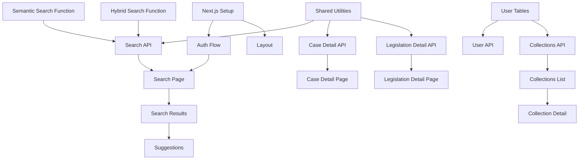

# Phase 2 Sprint Plan: Search API & Web Application

> **Timeline**: Months 3-4 (8 weeks, 4 two-week sprints)
> **Goal**: Deliver a functional search API and basic web application for legal case research

---

## Sprint Overview

| Sprint | Focus | Duration |
|--------|-------|----------|
| Sprint 1 | Database Functions & Core API | 2 weeks |
| Sprint 2 | Search Enhancement & User Management | 2 weeks |
| Sprint 3 | Frontend Foundation & Search UI | 2 weeks |
| Sprint 4 | Case Details, Collections & Polish | 2 weeks |

---

## Sprint 1: Database Functions & Core API

### Feature 1.1: Semantic Search Database Functions

#### Story 1.1.1: Implement Vector Similarity Search Function

**Description**: Create a PostgreSQL function that performs semantic search on case embeddings using pgvector.

**Requirements**:
- Create a new Supabase migration file at `supabase/migrations/[timestamp]_add_search_functions.sql`
- Implement `search_cases_semantic(query_embedding vector(1024), match_count int, filter_court text DEFAULT NULL, filter_year_from int DEFAULT NULL, filter_year_to int DEFAULT NULL)` function
- The function should:
  - Query `case_embeddings_cohere` table using cosine similarity (`<=>` operator)
  - Join with `court_cases` table to return case metadata
  - Support optional filtering by court code and date range
  - Return columns: `id`, `neutral_citation`, `case_name`, `court_id`, `decision_date`, `headnote`, `similarity_score`
  - Order results by similarity score descending
  - Limit to `match_count` results
- Add appropriate index if not already present: `CREATE INDEX IF NOT EXISTS idx_case_embeddings_cohere_embedding ON case_embeddings_cohere USING hnsw (embedding vector_cosine_ops)`

**Acceptance Criteria**:
- [ ] Migration file exists and applies without errors
- [ ] Function returns results ordered by similarity score
- [ ] Filtering by court works correctly
- [ ] Filtering by year range works correctly
- [ ] Results include all required metadata fields
- [ ] Query executes in under 500ms for 100k+ embeddings

---

#### Story 1.1.2: Implement Hybrid Search Function

**Description**: Create a PostgreSQL function combining semantic and full-text search with configurable weighting.

**Requirements**:
- Add to the same migration file from Story 1.1.1
- Implement `search_cases_hybrid(query_text text, query_embedding vector(1024), match_count int, semantic_weight float DEFAULT 0.7, filter_court text DEFAULT NULL, filter_year_from int DEFAULT NULL, filter_year_to int DEFAULT NULL)` function
- The function should:
  - Perform full-text search on `court_cases.full_text` using `to_tsvector` and `plainto_tsquery`
  - Perform semantic search on `case_embeddings_cohere`
  - Combine scores: `final_score = (semantic_weight * semantic_score) + ((1 - semantic_weight) * fts_score)`
  - Normalize both scores to 0-1 range before combining
  - Return: `id`, `neutral_citation`, `case_name`, `court_id`, `decision_date`, `headnote`, `semantic_score`, `fts_score`, `combined_score`
- Add GIN index for full-text search: `CREATE INDEX IF NOT EXISTS idx_court_cases_fulltext ON court_cases USING gin(to_tsvector('english', full_text))`

**Acceptance Criteria**:
- [ ] Hybrid search returns results combining both methods
- [ ] Weight parameter correctly influences ranking
- [ ] Full-text matches boost relevant results
- [ ] All filters work correctly
- [ ] Query performance under 1 second

---

#### Story 1.1.3: Implement Legislation Search Functions

**Description**: Create semantic and hybrid search functions for legislation.

**Requirements**:
- Add to the same migration file
- Implement `search_legislation_semantic(query_embedding vector(1024), match_count int, filter_type text DEFAULT NULL)` function
- Implement `search_legislation_hybrid(query_text text, query_embedding vector(1024), match_count int, semantic_weight float DEFAULT 0.7)` function
- Functions should:
  - Query `legislation_embeddings_cohere` and join with `legislation_sections` and `legislation`
  - Return: `section_id`, `legislation_id`, `chapter_number`, `title_en`, `section_number`, `section_title`, `content_snippet`, `similarity_score`
  - Support filtering by legislation type (ordinance, regulation, etc.)

**Acceptance Criteria**:
- [ ] Both functions work correctly
- [ ] Results include legislation metadata and section details
- [ ] Content snippets are truncated appropriately (max 500 chars)
- [ ] Type filtering works

---

### Feature 1.2: Core Search API

#### Story 1.2.1: Create Search Edge Function

**Description**: Implement the main search API endpoint as a Supabase Edge Function.

**Requirements**:
- Create `supabase/functions/search/index.ts`
- Create `supabase/functions/search/types.ts` for TypeScript interfaces
- The endpoint should:
  - Accept POST requests with JSON body:
    ```typescript
    interface SearchRequest {
      query: string;
      type: 'cases' | 'legislation' | 'all';
      filters?: {
        court?: string;
        yearFrom?: number;
        yearTo?: number;
        legislationType?: string;
      };
      options?: {
        limit?: number; // default 20, max 100
        offset?: number;
        searchMode?: 'semantic' | 'hybrid'; // default 'hybrid'
        semanticWeight?: number; // default 0.7
      };
    }
    ```
  - Generate query embedding by calling Amazon Bedrock Titan Embeddings V2 API
  - Call appropriate database search function(s)
  - Return standardized response:
    ```typescript
    interface SearchResponse {
      results: SearchResult[];
      total: number;
      query: string;
      searchMode: string;
      timing: { embedding_ms: number; search_ms: number; total_ms: number };
    }
    ```
- Use Deno's native `fetch` for Bedrock API calls
- Include proper error handling with appropriate HTTP status codes
- Add CORS headers for frontend access

**Acceptance Criteria**:
- [ ] Endpoint accessible at `/functions/v1/search`
- [ ] Returns valid JSON response
- [ ] Query embedding generation works with Bedrock
- [ ] Both case and legislation search work
- [ ] Pagination via limit/offset works
- [ ] Error responses include meaningful messages
- [ ] Response time under 2 seconds for typical queries
- [ ] CORS headers present for allowed origins

---

#### Story 1.2.2: Create Case Detail Edge Function

**Description**: Implement API endpoint to retrieve full case details.

**Requirements**:
- Create `supabase/functions/cases/index.ts`
- The endpoint should:
  - Accept GET requests: `/functions/v1/cases/:id`
  - Return full case data:
    ```typescript
    interface CaseDetailResponse {
      id: string;
      neutral_citation: string;
      case_number: string;
      case_name: string;
      court: { id: string; name_en: string; code: string };
      decision_date: string;
      judges: string[];
      parties: object;
      headnote: string;
      full_text: string;
      source_url: string;
      pdf_url?: string;
      related_cases?: { id: string; citation: string; name: string; relationship: string }[];
    }
    ```
  - Query `court_cases` joined with `courts`
  - Return 404 if case not found
- Handle UUID validation

**Acceptance Criteria**:
- [ ] Endpoint returns complete case data
- [ ] Court information is joined correctly
- [ ] 404 returned for non-existent cases
- [ ] Invalid UUID returns 400 error
- [ ] Response time under 200ms

---

#### Story 1.2.3: Create Legislation Detail Edge Function

**Description**: Implement API endpoint to retrieve legislation details with sections.

**Requirements**:
- Create `supabase/functions/legislation/index.ts`
- Accept GET requests: `/functions/v1/legislation/:id`
- Return:
  ```typescript
  interface LegislationDetailResponse {
    id: string;
    chapter_number: string;
    title_en: string;
    title_zh?: string;
    type: string;
    status: string;
    commencement_date?: string;
    source_url: string;
    sections: LegislationSection[];
    schedules: LegislationSchedule[];
  }
  ```
- Include all sections ordered by `order_index`

**Acceptance Criteria**:
- [ ] Full legislation returned with all sections
- [ ] Sections ordered correctly
- [ ] Schedules included
- [ ] Proper error handling

---

### Feature 1.3: API Infrastructure

#### Story 1.3.1: Create Shared API Utilities

**Description**: Create shared utilities for Edge Functions.

**Requirements**:
- Create `supabase/functions/_shared/` directory
- Create `supabase/functions/_shared/cors.ts`:
  - Export `corsHeaders` object with appropriate headers
  - Export `handleCors(req)` function for OPTIONS preflight
- Create `supabase/functions/_shared/bedrock.ts`:
  - Export `generateEmbedding(text: string): Promise<number[]>` function
  - Use AWS SDK v3 for Deno or raw API calls
  - Handle token truncation (max 8192 tokens)
  - Configure using environment variables: `AWS_ACCESS_KEY_ID`, `AWS_SECRET_ACCESS_KEY`, `AWS_REGION`
- Create `supabase/functions/_shared/db.ts`:
  - Export `getSupabaseClient()` function using service role key
  - Export `getDbConnection()` for direct Postgres queries via `postgres` module
- Create `supabase/functions/_shared/errors.ts`:
  - Export standardized error response helpers
  - `badRequest(message)`, `notFound(message)`, `serverError(message)`

**Acceptance Criteria**:
- [ ] All shared utilities are importable from Edge Functions
- [ ] CORS handling works for all endpoints
- [ ] Bedrock embedding generation works
- [ ] Database connections are properly configured
- [ ] Error responses follow consistent format

---

## Sprint 2: Search Enhancement & User Management

### Feature 2.1: Query Enhancement

#### Story 2.1.1: Implement Query Understanding

**Description**: Enhance search queries using LLM to improve search quality.

**Requirements**:
- Create `supabase/functions/_shared/query-enhancement.ts`
- Implement `enhanceQuery(query: string): Promise<EnhancedQuery>`:
  ```typescript
  interface EnhancedQuery {
    originalQuery: string;
    expandedQuery: string; // Synonyms and related terms added
    legalConcepts: string[]; // Extracted legal concepts
    jurisdiction?: string; // Detected jurisdiction reference
    caseType?: string; // e.g., "criminal", "civil", "family"
    suggestedFilters?: { court?: string; yearRange?: [number, number] };
  }
  ```
- Use Claude 3 Haiku via Bedrock for fast inference
- Create a focused prompt that:
  - Identifies legal terminology
  - Expands abbreviations (e.g., "CFA" → "Court of Final Appeal")
  - Suggests relevant case types and courts
- Cache common query patterns (optional enhancement)
- Update search Edge Function to use enhanced queries

**Acceptance Criteria**:
- [ ] Query enhancement returns expanded query
- [ ] Legal concepts are correctly identified
- [ ] Enhancement adds under 300ms latency
- [ ] Works with both simple and complex queries
- [ ] Handles non-English queries gracefully

---

#### Story 2.1.2: Implement Search Suggestions

**Description**: Provide autocomplete suggestions as users type.

**Requirements**:
- Create `supabase/functions/suggestions/index.ts`
- Accept GET request: `/functions/v1/suggestions?q=<partial_query>&type=<cases|legislation>`
- Return:
  ```typescript
  interface SuggestionsResponse {
    suggestions: {
      text: string;
      type: 'citation' | 'case_name' | 'legal_term' | 'legislation';
      metadata?: { id?: string; court?: string };
    }[];
  }
  ```
- Implement prefix matching on:
  - `court_cases.neutral_citation` (e.g., "[2024] HK..." → matching cases)
  - `court_cases.case_name` (trigram similarity)
  - `legislation.chapter_number` and `title_en`
- Limit to 10 suggestions
- Use PostgreSQL trigram extension for fuzzy matching

**Acceptance Criteria**:
- [ ] Suggestions return within 100ms
- [ ] Citation prefix matching works
- [ ] Case name fuzzy matching works
- [ ] Results are relevant to partial input
- [ ] Response limited to 10 items

---

### Feature 2.2: User Management Schema

#### Story 2.2.1: Create User Management Tables

**Description**: Add database tables for user profiles and preferences.

**Requirements**:
- Create migration `supabase/migrations/[timestamp]_add_user_management.sql`
- Create tables:
  ```sql
  CREATE TABLE user_profiles (
    id UUID PRIMARY KEY REFERENCES auth.users(id) ON DELETE CASCADE,
    email TEXT NOT NULL,
    full_name TEXT,
    organization TEXT,
    subscription_tier TEXT DEFAULT 'free' CHECK (subscription_tier IN ('free', 'professional', 'enterprise')),
    search_quota_daily INT DEFAULT 50,
    searches_today INT DEFAULT 0,
    quota_reset_at TIMESTAMPTZ DEFAULT NOW(),
    preferences JSONB DEFAULT '{}',
    created_at TIMESTAMPTZ DEFAULT NOW(),
    updated_at TIMESTAMPTZ DEFAULT NOW()
  );

  CREATE TABLE user_searches (
    id UUID PRIMARY KEY DEFAULT uuid_generate_v4(),
    user_id UUID REFERENCES user_profiles(id) ON DELETE CASCADE,
    query TEXT NOT NULL,
    search_type TEXT NOT NULL,
    filters JSONB,
    result_count INT,
    clicked_results UUID[],
    created_at TIMESTAMPTZ DEFAULT NOW()
  );

  CREATE TABLE user_collections (
    id UUID PRIMARY KEY DEFAULT uuid_generate_v4(),
    user_id UUID NOT NULL REFERENCES user_profiles(id) ON DELETE CASCADE,
    name TEXT NOT NULL,
    description TEXT,
    is_public BOOLEAN DEFAULT FALSE,
    created_at TIMESTAMPTZ DEFAULT NOW(),
    updated_at TIMESTAMPTZ DEFAULT NOW()
  );

  CREATE TABLE collection_items (
    id UUID PRIMARY KEY DEFAULT uuid_generate_v4(),
    collection_id UUID NOT NULL REFERENCES user_collections(id) ON DELETE CASCADE,
    item_type TEXT NOT NULL CHECK (item_type IN ('case', 'legislation')),
    item_id UUID NOT NULL,
    notes TEXT,
    added_at TIMESTAMPTZ DEFAULT NOW()
  );
  ```
- Enable RLS on all tables
- Create policies:
  - Users can only read/write their own profiles
  - Users can only access their own searches and collections
  - Public collections are readable by all authenticated users
- Create trigger to auto-create profile on user signup

**Acceptance Criteria**:
- [ ] All tables created with proper constraints
- [ ] RLS policies enforce user isolation
- [ ] Profile auto-creation works on signup
- [ ] Subscription tiers correctly constrain search quotas

---

#### Story 2.2.2: Create User API Endpoints

**Description**: Implement API endpoints for user profile and preferences.

**Requirements**:
- Create `supabase/functions/users/index.ts`
- Endpoints:
  - `GET /functions/v1/users/me` - Get current user profile
  - `PATCH /functions/v1/users/me` - Update profile (full_name, organization, preferences)
  - `GET /functions/v1/users/me/quota` - Get remaining search quota
- Require authentication (validate JWT from `Authorization` header)
- Implement quota checking and decrementing in search function
- Reset quota daily using `quota_reset_at` field

**Acceptance Criteria**:
- [ ] Profile endpoints require authentication
- [ ] Users can update allowed fields only
- [ ] Quota tracking works correctly
- [ ] Quota resets after 24 hours

---

### Feature 2.3: Collections API

#### Story 2.3.1: Implement Collections CRUD

**Description**: Create API for managing user collections.

**Requirements**:
- Create `supabase/functions/collections/index.ts`
- Endpoints:
  - `GET /functions/v1/collections` - List user's collections
  - `POST /functions/v1/collections` - Create collection
  - `GET /functions/v1/collections/:id` - Get collection with items
  - `PATCH /functions/v1/collections/:id` - Update collection
  - `DELETE /functions/v1/collections/:id` - Delete collection
  - `POST /functions/v1/collections/:id/items` - Add item to collection
  - `DELETE /functions/v1/collections/:id/items/:itemId` - Remove item
- All endpoints require authentication
- Validate user owns collection before modification
- When fetching collection, join with `court_cases` or `legislation` to include item details

**Acceptance Criteria**:
- [ ] All CRUD operations work
- [ ] Users cannot access others' private collections
- [ ] Adding duplicate items is prevented
- [ ] Deleting collection cascades to items
- [ ] Collection items include full case/legislation metadata

---

## Sprint 3: Frontend Foundation & Search UI

### Feature 3.1: Next.js Application Setup

#### Story 3.1.1: Initialize Next.js Project

**Description**: Set up the Next.js 15 application with all required dependencies.

**Requirements**:
- Initialize project in `www/` directory using `npx create-next-app@latest`
- Configure with:
  - TypeScript
  - Tailwind CSS
  - App Router
  - ESLint
- Install dependencies:
  ```bash
  npm install @supabase/supabase-js @supabase/auth-helpers-nextjs
  npm install @tanstack/react-query
  npm install lucide-react
  npm install class-variance-authority clsx tailwind-merge
  npx shadcn@latest init
  ```
- Add shadcn components: `button`, `input`, `card`, `dialog`, `dropdown-menu`, `tabs`, `badge`, `skeleton`, `toast`
- Create directory structure:
  ```
  www/
  ├── app/
  │   ├── (auth)/
  │   │   ├── login/
  │   │   └── signup/
  │   ├── (main)/
  │   │   ├── search/
  │   │   ├── cases/[id]/
  │   │   ├── legislation/[id]/
  │   │   └── collections/
  │   ├── layout.tsx
  │   └── page.tsx
  ├── components/
  │   ├── ui/           # shadcn components
  │   ├── search/
  │   ├── cases/
  │   └── layout/
  ├── lib/
  │   ├── supabase/
  │   ├── api/
  │   └── utils/
  └── types/
  ```
- Configure environment variables in `.env.local`:
  - `NEXT_PUBLIC_SUPABASE_URL`
  - `NEXT_PUBLIC_SUPABASE_ANON_KEY`
  - `NEXT_PUBLIC_API_URL`

**Acceptance Criteria**:
- [ ] Next.js app runs with `npm run dev`
- [ ] Tailwind CSS is configured and working
- [ ] shadcn components are installed
- [ ] Directory structure matches specification
- [ ] Environment variables are documented

---

#### Story 3.1.2: Implement Authentication Flow

**Description**: Set up Supabase authentication with login/signup pages.

**Requirements**:
- Create `lib/supabase/client.ts` - Browser Supabase client
- Create `lib/supabase/server.ts` - Server-side Supabase client
- Create `lib/supabase/middleware.ts` - Session refresh middleware
- Update `middleware.ts` to protect routes
- Create pages:
  - `app/(auth)/login/page.tsx` - Email/password login form
  - `app/(auth)/signup/page.tsx` - Registration form
- Implement components:
  - `components/auth/LoginForm.tsx`
  - `components/auth/SignupForm.tsx`
  - `components/auth/AuthProvider.tsx` - Context for auth state
- Support:
  - Email/password authentication
  - "Remember me" functionality
  - Password reset flow
  - Redirect to search after login

**Acceptance Criteria**:
- [ ] Users can sign up with email/password
- [ ] Users can log in
- [ ] Session persists across page reloads
- [ ] Protected routes redirect to login
- [ ] Password reset email works
- [ ] Error messages display for invalid credentials

---

#### Story 3.1.3: Create Application Layout

**Description**: Implement the main application layout with navigation.

**Requirements**:
- Create `components/layout/Header.tsx`:
  - Logo/brand link to home
  - Main navigation: Search, Collections
  - User menu dropdown (profile, logout)
  - Responsive mobile menu
- Create `components/layout/Footer.tsx`:
  - Copyright notice
  - Links: About, Terms, Privacy
- Create `app/(main)/layout.tsx`:
  - Include Header and Footer
  - Main content area with max-width container
- Style using Tailwind:
  - Clean, professional legal aesthetic
  - Primary color: Deep blue (#1e3a5f)
  - Accent color: Gold (#c9a227)
  - Proper spacing and typography

**Acceptance Criteria**:
- [ ] Header displays on all main pages
- [ ] Navigation links work correctly
- [ ] User menu shows when authenticated
- [ ] Mobile responsive layout works
- [ ] Footer is present on all pages

---

### Feature 3.2: Search Interface

#### Story 3.2.1: Create Search Page

**Description**: Implement the main search interface.

**Requirements**:
- Create `app/(main)/search/page.tsx`
- Create `components/search/SearchBar.tsx`:
  - Large text input for natural language queries
  - Search button with loading state
  - Keyboard shortcut (Cmd/Ctrl + K) to focus
  - Placeholder: "Search for cases, legislation, or legal concepts..."
- Create `components/search/SearchFilters.tsx`:
  - Collapsible filter panel
  - Court selector (multi-select)
  - Date range picker (year from/to)
  - Document type toggle (Cases / Legislation / All)
  - Search mode toggle (Semantic / Hybrid)
  - Clear filters button
- Create `lib/api/search.ts`:
  - `searchCases(params)` - API call wrapper
  - `searchLegislation(params)` - API call wrapper
  - Use React Query for caching and state management
- Implement URL-based state:
  - Sync search params with URL query string
  - Support direct linking to search results

**Acceptance Criteria**:
- [ ] Search input accepts queries
- [ ] Filters modify search parameters
- [ ] Search triggers on Enter or button click
- [ ] Loading state displays during search
- [ ] URL updates with search parameters
- [ ] Direct URL access restores search state

---

#### Story 3.2.2: Create Search Results Component

**Description**: Display search results with relevance indicators.

**Requirements**:
- Create `components/search/SearchResults.tsx`:
  - List of result cards
  - Empty state with suggestions
  - Error state with retry option
- Create `components/search/CaseResultCard.tsx`:
  - Case name (linked to detail page)
  - Neutral citation
  - Court badge
  - Decision date
  - Headnote snippet (first 200 chars)
  - Relevance score indicator (bar or percentage)
  - "Save to collection" button
- Create `components/search/LegislationResultCard.tsx`:
  - Chapter number and title
  - Section reference if applicable
  - Type badge (Ordinance, Regulation, etc.)
  - Content snippet
  - Relevance score
- Implement pagination:
  - "Load more" button or infinite scroll
  - Results count display
- Add sorting options:
  - Relevance (default)
  - Date (newest first)
  - Date (oldest first)

**Acceptance Criteria**:
- [ ] Results display with all required fields
- [ ] Clicking result navigates to detail page
- [ ] Relevance scores are visible
- [ ] Pagination loads more results
- [ ] Empty and error states display appropriately
- [ ] Sorting changes result order

---

#### Story 3.2.3: Implement Search Suggestions

**Description**: Add autocomplete suggestions to search input.

**Requirements**:
- Create `components/search/SearchSuggestions.tsx`:
  - Dropdown below search input
  - Shows suggestions as user types (debounced 300ms)
  - Categories: Recent searches, Citations, Case names, Legislation
  - Keyboard navigation (up/down arrows, Enter to select)
  - Click to select suggestion
- Create `lib/api/suggestions.ts`:
  - `getSuggestions(query, type)` function
- Store recent searches in localStorage
- Display recent searches when input is focused but empty

**Acceptance Criteria**:
- [ ] Suggestions appear after typing 2+ characters
- [ ] Suggestions are categorized
- [ ] Keyboard navigation works
- [ ] Clicking suggestion fills input and searches
- [ ] Recent searches display on focus

---

## Sprint 4: Case Details, Collections & Polish

### Feature 4.1: Case Detail View

#### Story 4.1.1: Create Case Detail Page

**Description**: Implement the full case detail view.

**Requirements**:
- Create `app/(main)/cases/[id]/page.tsx`
- Create `components/cases/CaseHeader.tsx`:
  - Case name (large)
  - Neutral citation
  - Court and decision date
  - Judges list
  - Actions: Save to collection, Share, Export
- Create `components/cases/CaseContent.tsx`:
  - Tabbed interface: Summary | Full Judgment | Citations
  - Summary tab: AI-generated headnote
  - Full Judgment tab: Complete text with paragraph numbers
  - Citations tab: Placeholder for future citation network
- Create `components/cases/CaseMetadata.tsx`:
  - Sidebar with metadata
  - Parties information
  - Subject tags
  - Related legislation links
- Implement data fetching:
  - Use React Query with `useQuery`
  - Loading skeleton
  - Error handling with retry

**Acceptance Criteria**:
- [ ] Page loads case data from API
- [ ] All tabs display correct content
- [ ] Metadata sidebar shows case details
- [ ] Loading skeleton appears during fetch
- [ ] 404 page for non-existent cases
- [ ] Actions buttons are functional (or placeholder)

---

#### Story 4.1.2: Create Legislation Detail Page

**Description**: Implement legislation detail view with sections.

**Requirements**:
- Create `app/(main)/legislation/[id]/page.tsx`
- Create `components/legislation/LegislationHeader.tsx`:
  - Chapter number and title
  - Type and status badges
  - Commencement date
  - Actions: Save, Share, View on eLegislation
- Create `components/legislation/SectionsList.tsx`:
  - Expandable sections list
  - Section numbers and titles
  - Full content on expand
  - Quick navigation/table of contents
- Create `components/legislation/SchedulesList.tsx`:
  - Collapsible schedule sections
- Implement section search:
  - Search within legislation sections
  - Highlight matching terms

**Acceptance Criteria**:
- [ ] Page displays legislation with all sections
- [ ] Sections are expandable
- [ ] Table of contents navigation works
- [ ] Search within legislation works
- [ ] External link to eLegislation opens correctly

---

### Feature 4.2: Collections Management

#### Story 4.2.1: Create Collections List Page

**Description**: Implement page to view and manage collections.

**Requirements**:
- Create `app/(main)/collections/page.tsx`
- Create `components/collections/CollectionsList.tsx`:
  - Grid of collection cards
  - Collection name, description, item count
  - Created/updated date
  - Quick actions: Edit, Delete
- Create `components/collections/CreateCollectionDialog.tsx`:
  - Modal form for new collection
  - Name (required), Description (optional)
  - Public/private toggle
- Implement:
  - Empty state for no collections
  - Delete confirmation dialog
  - Optimistic updates with React Query

**Acceptance Criteria**:
- [ ] Collections list displays correctly
- [ ] Create new collection works
- [ ] Edit collection name/description works
- [ ] Delete with confirmation works
- [ ] Item counts are accurate

---

#### Story 4.2.2: Create Collection Detail Page

**Description**: Implement collection detail with saved items.

**Requirements**:
- Create `app/(main)/collections/[id]/page.tsx`
- Create `components/collections/CollectionHeader.tsx`:
  - Collection name (editable inline)
  - Description
  - Item count
  - Actions: Export, Share (if public)
- Create `components/collections/CollectionItems.tsx`:
  - List of saved cases and legislation
  - Same card format as search results
  - Remove from collection button
  - Add notes to item
- Create `components/collections/AddToCollectionButton.tsx`:
  - Reusable button for search results and detail pages
  - Dropdown to select collection or create new
- Implement:
  - Drag-and-drop reordering (optional)
  - Bulk selection and removal

**Acceptance Criteria**:
- [ ] Collection items display correctly
- [ ] Remove item works
- [ ] Notes can be added/edited
- [ ] Add to collection from search/detail works
- [ ] Collection updates reflect immediately

---

### Feature 4.3: Polish & Performance

#### Story 4.3.1: Implement Loading States and Error Handling

**Description**: Add consistent loading and error UX across the application.

**Requirements**:
- Create `components/ui/LoadingSkeleton.tsx`:
  - Reusable skeleton components
  - Match actual content layout
- Create `components/ui/ErrorBoundary.tsx`:
  - Catch React errors
  - Display friendly error message
  - Retry button
- Create `components/ui/ErrorDisplay.tsx`:
  - API error display
  - Different messages for 400, 401, 404, 500
- Implement throughout app:
  - All pages have loading states
  - All API calls have error handling
  - Toast notifications for actions

**Acceptance Criteria**:
- [ ] Every page has appropriate loading skeleton
- [ ] API errors display user-friendly messages
- [ ] Error boundary catches crashes
- [ ] Toast notifications for save/delete actions
- [ ] Retry functionality works

---

#### Story 4.3.2: Performance Optimization

**Description**: Optimize application performance.

**Requirements**:
- Implement code splitting:
  - Dynamic imports for heavy components
  - Route-based splitting (automatic with App Router)
- Optimize images:
  - Use Next.js Image component
  - Lazy load below-fold images
- Implement caching:
  - React Query stale-while-revalidate
  - Appropriate cache times (cases: 1 hour, search: 5 minutes)
- Add performance monitoring:
  - Web Vitals tracking
  - Log slow API calls
- SEO optimization:
  - Metadata for all pages
  - Open Graph tags
  - robots.txt and sitemap.xml

**Acceptance Criteria**:
- [ ] Lighthouse performance score > 80
- [ ] First Contentful Paint < 1.5s
- [ ] Time to Interactive < 3s
- [ ] Bundle size analysis shows no major issues
- [ ] Search results cached appropriately

---

#### Story 4.3.3: Responsive Design & Accessibility

**Description**: Ensure application is responsive and accessible.

**Requirements**:
- Test and fix responsive layouts:
  - Mobile (< 640px)
  - Tablet (640px - 1024px)
  - Desktop (> 1024px)
- Implement accessibility features:
  - Proper heading hierarchy
  - ARIA labels on interactive elements
  - Keyboard navigation for all features
  - Focus indicators
  - Screen reader compatibility
  - Color contrast compliance (WCAG AA)
- Add skip links for keyboard users
- Test with screen reader (VoiceOver/NVDA)

**Acceptance Criteria**:
- [ ] All pages work on mobile devices
- [ ] No horizontal scroll on mobile
- [ ] All interactive elements keyboard accessible
- [ ] Lighthouse accessibility score > 90
- [ ] Color contrast passes WCAG AA

---

## Definition of Done

Each story is considered complete when:

1. **Code Complete**: All requirements implemented
2. **Tests Passing**: Unit tests and integration tests pass
3. **Code Reviewed**: Changes reviewed (or self-reviewed if solo)
4. **Documentation**: README updated if needed, API documented
5. **Deployed**: Merged to main and deployed to staging
6. **Acceptance Criteria**: All criteria verified

---

## Dependencies



---

## Risk Mitigation

| Risk | Mitigation |
|------|------------|
| Bedrock API latency | Cache embeddings for common queries; use batch processing |
| Search relevance issues | Implement feedback mechanism; tune hybrid weights |
| Frontend complexity | Start with MVP features; defer advanced features |
| Authentication edge cases | Use Supabase's battle-tested auth; test thoroughly |
| Mobile performance | Profile early; optimize critical rendering path |
